<p align="center">
  
</p>

<p align="center">
  <a href="https://git.io/typing-svg">
    
  </a>
</p>

<p align="center">
  
  
</p>


### ⚡ About Me
```python
class Moein:
    username = "1moeiin"
    skills   = ["Python", "Django", "C++", "Tailwind CSS", "AI"]
    focus    = "Building smart web apps powered by AI"
    motto    = "Always number 1 🚀"
```

### 🛠️ Tech Stack
<p align="center">
  
</p>
<p align="center">
  
  
  
  
  
</p>

### 📊 GitHub Stats
<p align="center">
  
  
</p>
<p align="center">
  
</p>

### 📈 Contribution Graph


### 🐍 Snake
<picture>
  <source media="(prefers-color-scheme: dark)" srcset="https://raw.githubusercontent.com/1moeiin/1moeiin/output/github-snake-dark.svg"/>
  
</picture>

<p align="center">
  
</p>
